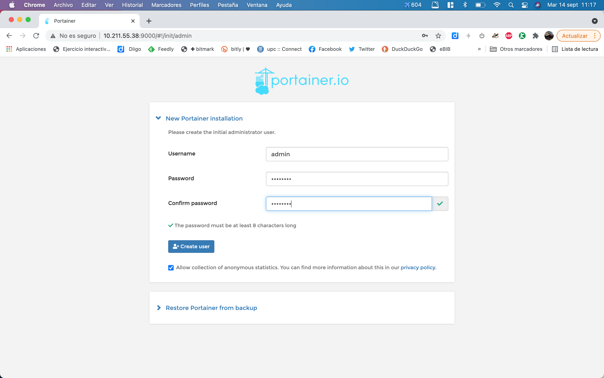
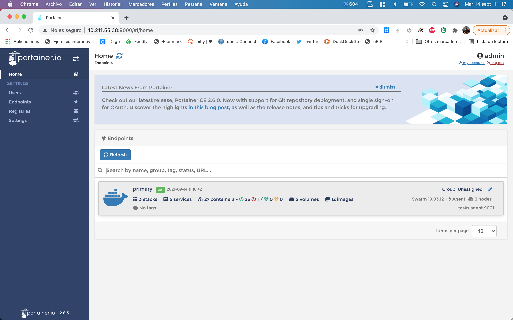
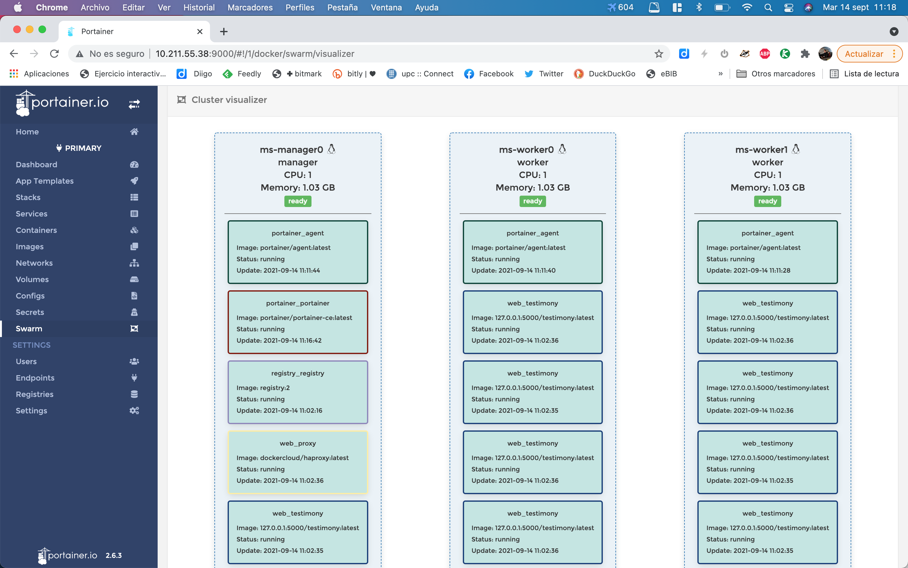
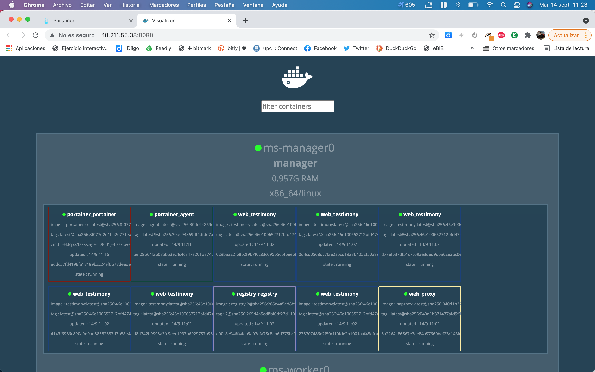

# Description

Simple example of a stack running a Node.js service

# Prerequisites

Start a docker swarm cluster, i.e use [miniswarm](https://github.com/aelsabbahy/miniswarm):

`miniswarm start 3`

Enter the manager:

`eval (docker-machine env ms-manager0)`

# Stacks

Each stack have a start script and, sometimes, also a build script. For example:

```
cd web
./build.sh
```

This will build the web image and push it to the registry service. In the same directory you can:

```
./start.sh
```

This will start 20 web instances and one HAProxy.

```
> docker service ls                                                                                          
ID             NAME            MODE         REPLICAS   IMAGE                             PORTS
bnx4yuxylti0   registry        replicated   1/1        registry:2                        *:5000->5000/tcp
1iarkur7uypa   web_proxy       replicated   1/1        dockercloud/haproxy:latest        *:80->80/tcp
n3h3mj3am1li   web_testimony   replicated   20/20      127.0.0.1:5000/testimony:latest   *:30000->8080/tcp
```
You can retrieve service address from miniswarm.

```
> miniswarm service web_testimony --url                                                                      
INFO: Connected to manager: ms-manager0
http://10.211.55.35:30000
```

Each time you access the service, a different container will answer.

```
> curl http://10.211.55.35:30000                                                                          
<h1>I'm on c7072d8f748d</h1>⏎

> curl http://10.211.55.35:30000                                                                                      
<h1>I'm on e4a29d7e8fbf</h1>⏎
```

You can also use the HAProxy instance that will balance between all the web instance.

```
> miniswarm service web_proxy --url                                                                                   
INFO: Connected to manager: ms-manager0
http://10.211.55.35:80

> curl http://10.211.55.35:80                                                                                
<h1>I'm on 4922846cea4b</h1>⏎

> curl http://10.211.55.35:80                                                                                     
<h1>I'm on c7072d8f748d</h1>⏎

```

## Ports

| Port  | Application                            |
|-------|----------------------------------------|
| 80    | HAProxy connected to web.              |
| 5000  | Registry                               |
| 8000  | Portainer                              |
| 8080  | Miniswarm vis (when started)           |
| 8081  | Matomo UI                              |
| 9000  | Portainer UI                           |
| 3000? | Web app (autoallocated)                |


## Portainer

This adds management capabilities to the Docker Swarm. If you connect to the port 9000:







## Miniswarm vis

A simpler visualizer is integrated with miniswarm:

```
miniswarm vis
```



# TODO

* Seems that registry stack needs a named volume
